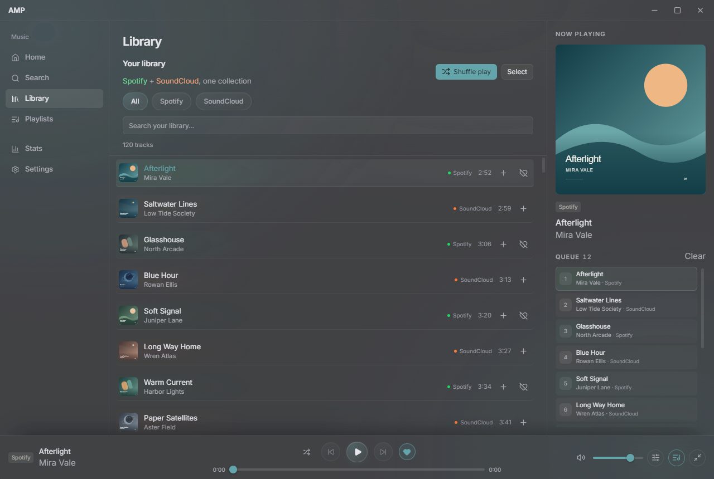
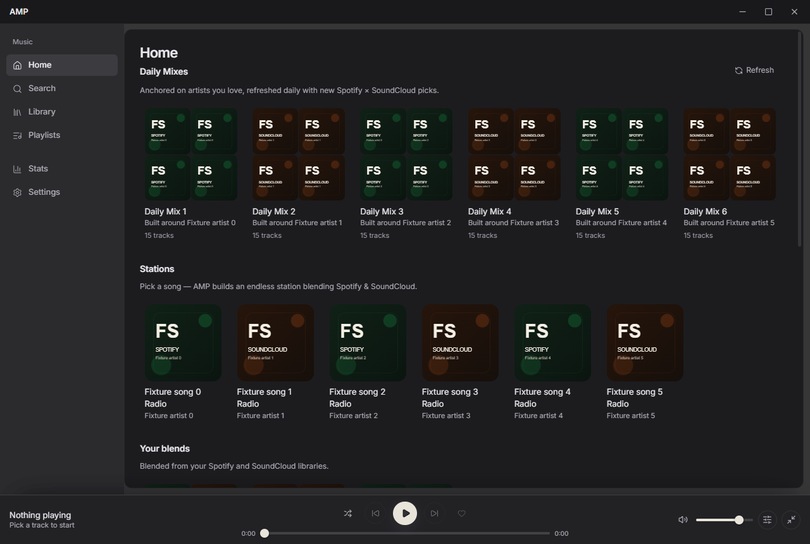
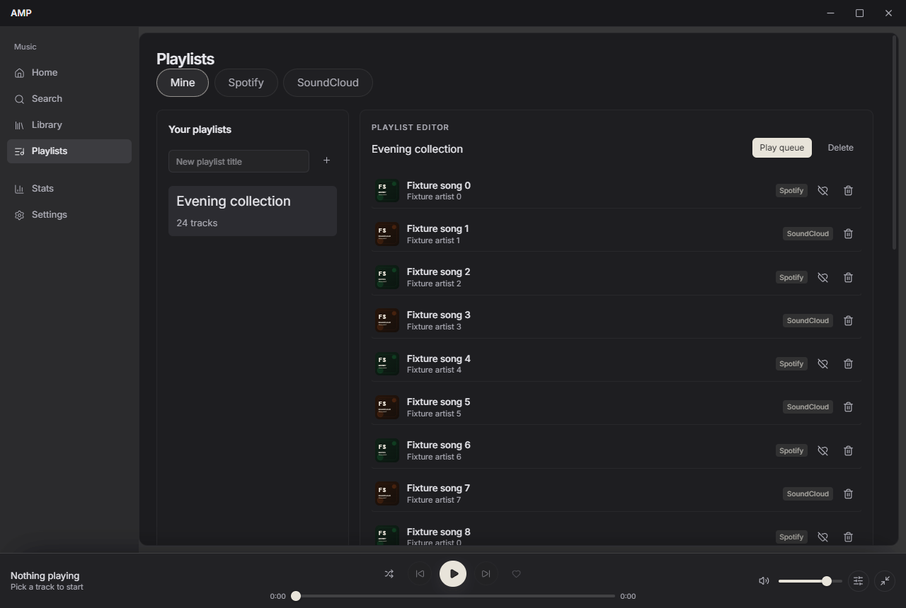
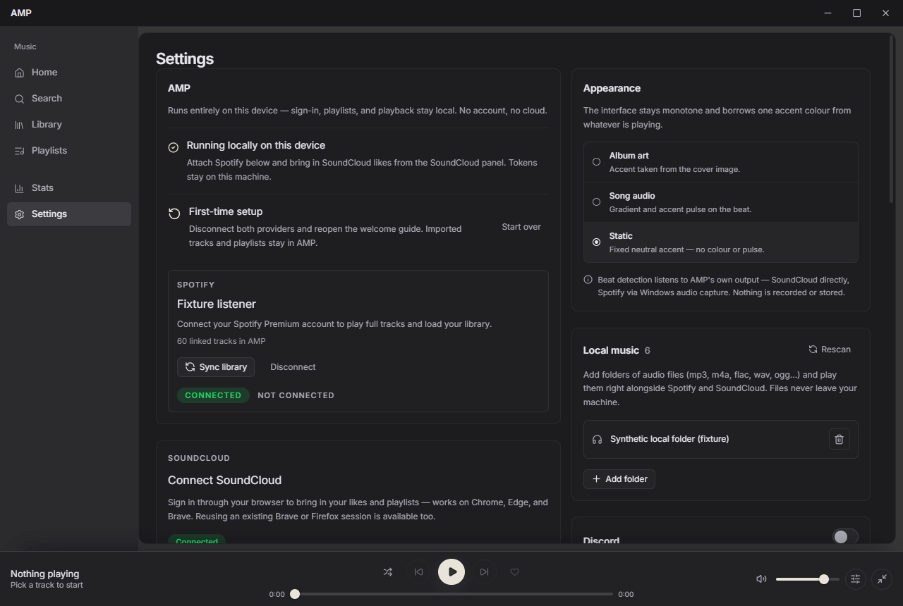

# AMP - Advanced Music Player

  

One library and playback queue for Spotify, SoundCloud and your own music.

**[Download AMP 0.3.7 for Windows](https://github.com/tbhtho/Advanced-Music-Player/releases/download/v0.3.7/AMP.Setup.0.3.7.exe)** · [Release notes and checksums](https://github.com/tbhtho/Advanced-Music-Player/releases/tag/v0.3.7)

   
  Library and Now Playing, captured from 0.3.7 with fictional demo tracks.

<table>
  <tr>
    <td width="50%"> Daily mixes and song stations. Earlier 0.3.5 interface.</td>
    <td width="50%"> Mixed-provider playlists. Earlier 0.3.5 interface.</td>
  </tr>
</table>

Settings and provider connections

   
  Connections, appearance and local music. Earlier 0.3.5 interface.

These are real frontend captures using sample libraries and account states. They do not demonstrate live playback. Select an image for full size. Original pixels are preserved; still captures do not verify animation or desktop blur.

## Get started

1. Download and run **AMP.Setup.0.3.7.exe**, then launch AMP.
2. Open **Settings** to connect Spotify or SoundCloud, or add a folder of local audio files.
3. Search for music, save tracks to your library, and build a playlist or queue across sources.

Spotify sign-in uses AMP's bundled public app configuration. Development-mode access requires an eligible, allowlisted account; playback requires Premium. SoundCloud search can work without signing in. Windows publisher signing is not configured, so SmartScreen may show a warning. Library import does not require Premium.

## Features

- **Search and local music:** Spotify, SoundCloud and existing YouTube search, plus local MP3, M4A, FLAC, WAV and OGG files.
- **Library, playlists and queue:** combine sources, reorder the queue, shuffle, seek and adjust volume by provider. A compact mini-player and media-key controls keep playback close.
- **Likes and saves:** Spotify and SoundCloud controls in the player bar, track lists, search results and playlists.
- **Discovery:** song-seeded stations and daily mixes scored by tempo, genre and mood; artist and album pages, with mood and genre filters.
- **Listening stats:** on-device listening history and statistics.
- **SoundCloud downloads:** audio downloads for eligible tracks.
- **Appearance:** continuous glass surfaces, cover-derived accents and an optional Windows audio pulse.
- **Discord:** optional Rich Presence.

Current source adds Glass only, Album pattern, Ambient drift and Solid colour backgrounds; the downloadable installer remains 0.3.7. In a controlled visible offline fixture on 16 logical processors, ambient CPU fell from 2.52% to 0.09% while paused and 3.24% to 0.26% with simulated playback ticks. These are whole-machine CPU measurements, not live provider playback or proof of lower RAM use.

Spotify crossfade is unavailable. YouTube uses its existing embedded player: ads may play without Premium, and videos that prohibit embedding are skipped. Encrypted SoundCloud tracks need the packaged production build. Higher memory use and recurring playback flicker remain under investigation. YouTube playlist import and Apple Music expansion remain deferred.

SoundCloud's optional Local Connect reads cookies from the browser profile you select. Sessions stay on this device and can be cleared in Settings; music requests still go to providers, and enabled Discord presence is sent to Discord. Optional SoundCloud API access uses your client ID/secret with callback `musync://soundcloud/callback`. An advanced Spotify client-ID override must register `http://127.0.0.1:8000/spotify/callback`.

Build from source

Use Node.js 22.18 or later, below 26, and pnpm 10.11.0: `corepack pnpm install --frozen-lockfile`, then `corepack pnpm dev`. Run `corepack pnpm verify` for tests, typecheck and build. These checks do not establish live provider playback.

Packaging with `corepack pnpm dist` requires Python 3, `castlabs-evs`, and an email-verified EVS account (`python -m castlabs_evs.account signup` or `reauth`). AMP's public Spotify ID is bundled; environment overrides must be public client IDs. CI signing uses `EVS_ACCOUNT_NAME` and `EVS_PASSWD`; keep credentials out of Git. Run `corepack pnpm --filter @amp/desktop verify:vmp` on packaged output. Development or deliberately unsigned builds cannot play encrypted SoundCloud tracks.

## License

No repository-wide license is declared. Source access does not grant redistribution permission; do not redistribute builds. Follow provider terms and retain third-party notices.
